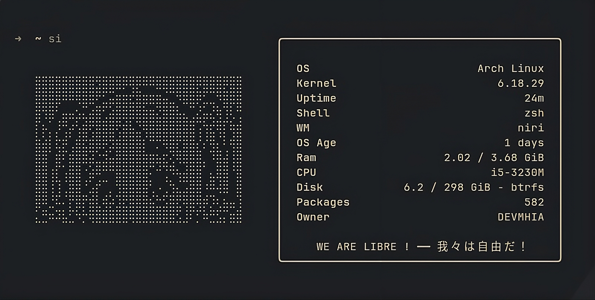

# Friefetch

It is basically a fastfetch config with Frieren as its ASCII art logo, thus Friefetch (yea I couldnt come up with a cooler name XD).
So I made the config myself but took ASCII art from an online source.

> [!NOTE]
> If you encounter that the OS age module is out of its alignment its likely due to your OS not being 10 days old, it will automatically realign itself when your OS turns 10 days old.

Made by [MHIA](https://github.com/MHashir09) !!
